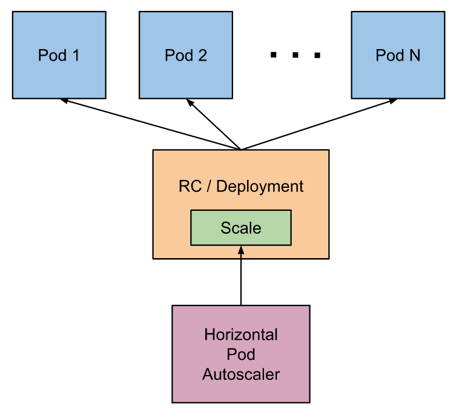

# Pod自动伸缩

HPA能根据负载的CPU使用量自动的增减RC，deployment，replica的数量，也可以基于custom指标或者其他根据应用定义的指标。HPA不能对有状态的应用自动伸缩，比如DaemonSet。

HPA是k8s定义的一种资源类型，有资源定义控制器的行为，控制器根据用户定义的CPU使用量的期望值来调整RC或者deployment的副本数。

HPA通过循环控制来实现，通过controller manager的`--horizontal-pod-autoscaler-sync-period`参数调整循环时间，默认值是15秒。

每隔一段时间，controller manager查询资源的实际使用量来和HorizontalPodAutoscaler定义的指标比对，controller manager通过资源指标API或者客户定义指标API获取定义指标。

    对于每一个pod资源定义例如CPU，通过HorizontalPodAutoscaler标识的需要指标的pod，控制器从资源指标API中获取指标。如果设置了目标原始值，则直接使用原始指标值。然后控制器将所有目标pod的使用率或者原始值（取决于制定的目标类型）取平均值，并产生一个用于缩放所需副本数量的比率。

请注意如果pod的容器没有设定目标值，CPU使用率不会被定义，自动伸缩不会生效。

    对于单个pod自定义指标，控制器的功能类似于按单价资源指标，不同之处在于它适用于原始值而非利用率值。
    对于对象指标或者外部指标，将获取单个指标，该指标描述了所讨论的对象。该指标与目标值进行对比，产生上述比率。在autoscaling/v2beta2API版本中，可以选择在进行比较之前将该值除以pod的数量。

HorizontalPodAutoscaler 通常从一系列聚合的API（metrics.k8s.io, custom.metrics.k8s.io和 external.metrics.k8s.io）中获取指标，metrics.k8s.io API通常由metics-server提供，需要单独启动。有关说明请参见metrics-server。