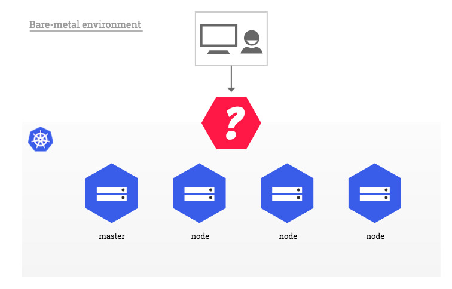

# Ingress服务

## ingress-nginx部署

### Deployment方式部署

我们在虚机环境中部署，所以选择Bare-metal的方式部署。部署的地址是：https://github.com/kubernetes/ingress-nginx/blob/master/docs/deploy/index.md

部署Deployment以及Role和RoleBinding

    kubectl apply -f https://raw.githubusercontent.com/kubernetes/ingress-nginx/master/deploy/static/mandatory.yaml
部署Service，采用NodePort方式

    kubectl apply -f https://raw.githubusercontent.com/kubernetes/ingress-nginx/master/deploy/static/provider/baremetal/service-nodeport.yaml

### 裸机部署的注意事项
在公有云环境中，自带网络负载均衡，单个k8s的api足够让nginx ingress controller和外部客户联系，并间接连接到集群内运行的任何应用。裸机环境就不行了，需要想办法提供外部客户可访问的方式。

下面介绍几种在裸机集群环境中部署Nginx Ingress Controller

## 使用MetalLB软件解决

MetalLB提供未运行在公有云提供的k8s环境下网络负载均衡的实现，对运行在任何集群下使用负载均衡的服务有效。

# nginxinc/kubernetes-ingress和kubernetes/ingress-nginx的不同

## 我该用哪个呢？

下面表格比较主要不同点

| Aspect or Feature | kubernetes/ingress-nginx | nginxinc/kubernetes-ingress with NGINX | nginxinc/kubernetes-ingress with NGINX Plus |
| --- | --- | --- | --- |
| **Fundamental** |
| Authors | Kubernetes community | NGINX Inc and community |  NGINX Inc and community |
| NGINX version | [Custom](https://github.com/kubernetes/ingress-nginx/tree/master/images/nginx) NGINX build that includes several third-party modules | NGINX official mainline [build](https://github.com/nginxinc/docker-nginx) | NGINX Plus |
| Commercial support | N/A | N/A | Included |
| **Load balancing configuration via the Ingress resource** |
| Merging Ingress rules with the same host | Supported | Supported via [Mergeable Ingresses](../examples/mergeable-ingress-types) | Supported via [Mergeable Ingresses](../examples/mergeable-ingress-types) |
| HTTP load balancing extensions - Annotations | See the [supported annotations](https://github.com/kubernetes/ingress-nginx/blob/master/docs/user-guide/nginx-configuration/annotations.md) | See the [supported annotations](configmap-and-annotations.md) | See the [supported annotations](configmap-and-annotations.md)|
| HTTP load balancing extensions -- ConfigMap | See the [supported ConfigMap keys](https://github.com/kubernetes/ingress-nginx/blob/master/docs/user-guide/nginx-configuration/configmap.md) | See the [supported ConfigMap keys](configmap-and-annotations.md) | See the [supported ConfigMap keys](configmap-and-annotations.md) |
| TCP/UDP | Supported via a ConfigMap | Supported via a ConfigMap with native NGINX configuration | Supported via a ConfigMap with native NGINX configuration |
| Websocket  | Supported | Supported via an [annotation](../examples/websocket) | Supported via an [annotation](../examples/websocket) |
| TCP SSL Passthrough | Supported via a ConfigMap | Not supported | Not supported |
| JWT validation | Not supported | Not supported | Supported |
| Session persistence | Supported via a third-party module | Not supported | Supported |
| Canary testing (by header, cookie, weight) | Supported via annotations | Supported via custom resources | Supported via custom resources |
| Configuration templates *1 | See the [template](https://github.com/kubernetes/ingress-nginx/blob/master/rootfs/etc/nginx/template/nginx.tmpl) | See the [templates](../internal/configs/version1) | See the [templates](../internal/configs/version1) |
| **Load balancing configuration via Custom Resources** |
| HTTP load balancing | Not supported | See [VirtualServer and VirtualServerRoute](virtualserver-and-virtualserverroute.md) resources. | See [VirtualServer and VirtualServerRoute](virtualserver-and-virtualserverroute.md) resources. |
| **Deployment** |
| Command-line arguments *2 | See the [arguments](https://github.com/kubernetes/ingress-nginx/blob/master/docs/user-guide/cli-arguments.md) | See the [arguments](cli-arguments.md) | See the [arguments](cli-arguments.md) |
| TLS certificate and key for the default server | Required as a command-line argument/ auto-generated | Required as a command-line argument | Required as a command-line argument |
| Helm chart | Supported | Supported | Supported |
| **Operational** |
| Reporting the IP address(es) of the Ingress controller into Ingress resources | Supported | Supported | Supported |
| Extended Status | Supported via a third-party module | Not supported | Supported |
| Prometheus Integration | Supported | Supported | Supported |
| Dynamic reconfiguration of endpoints (no configuration reloading) | Supported with a third-party Lua module | Not supported | Supported |

